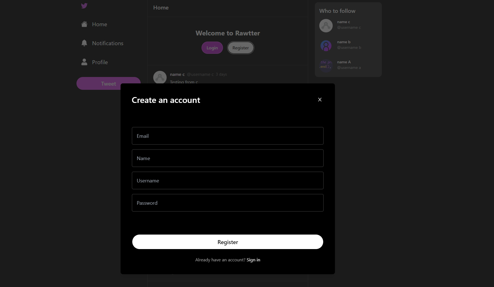
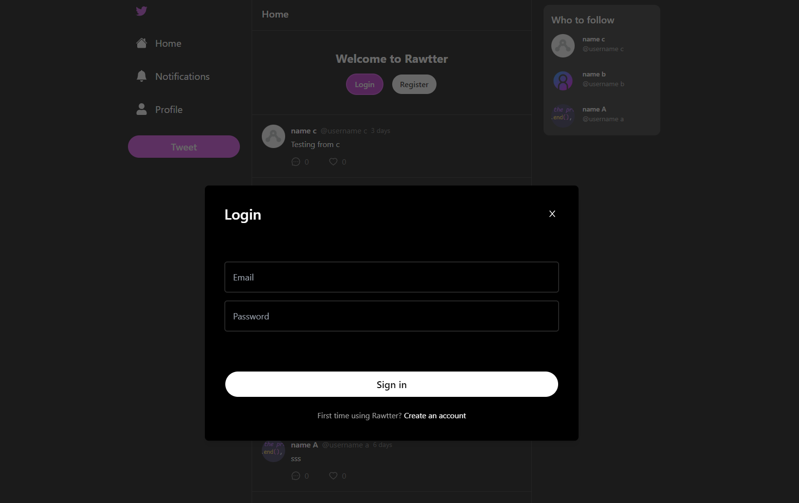
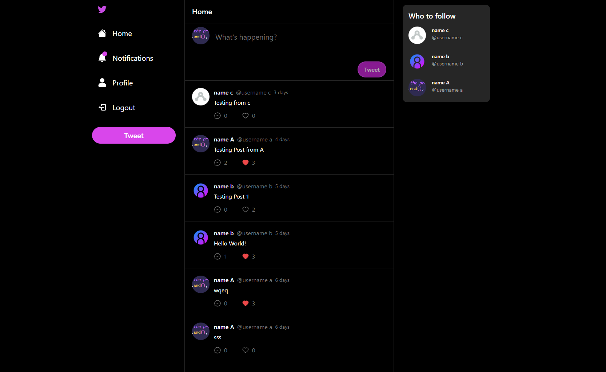
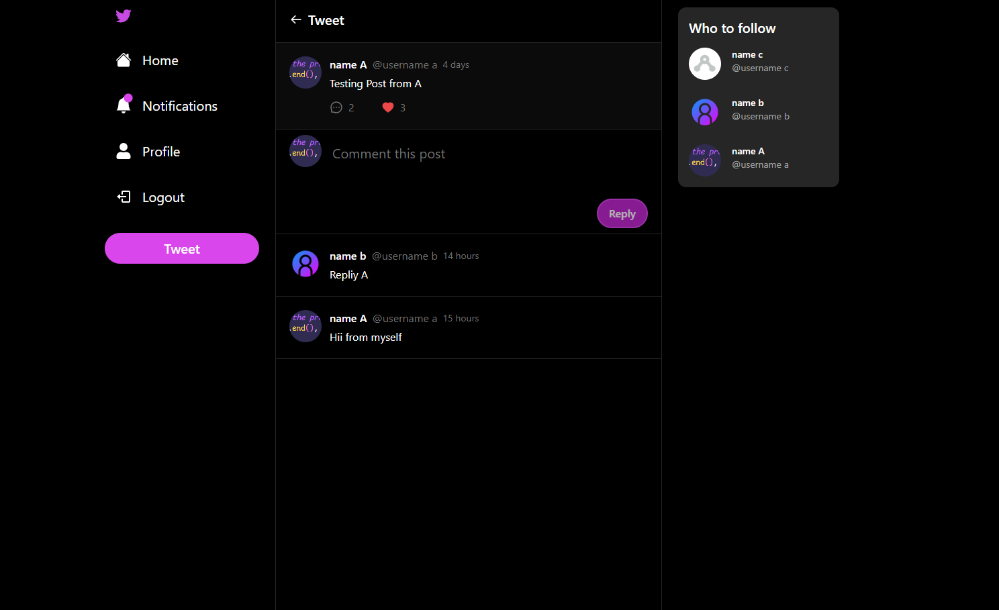
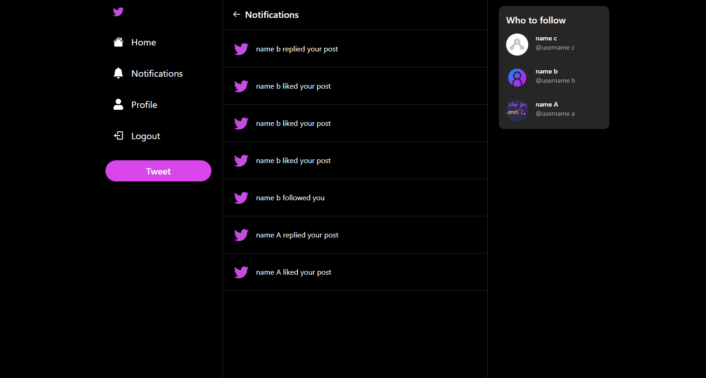
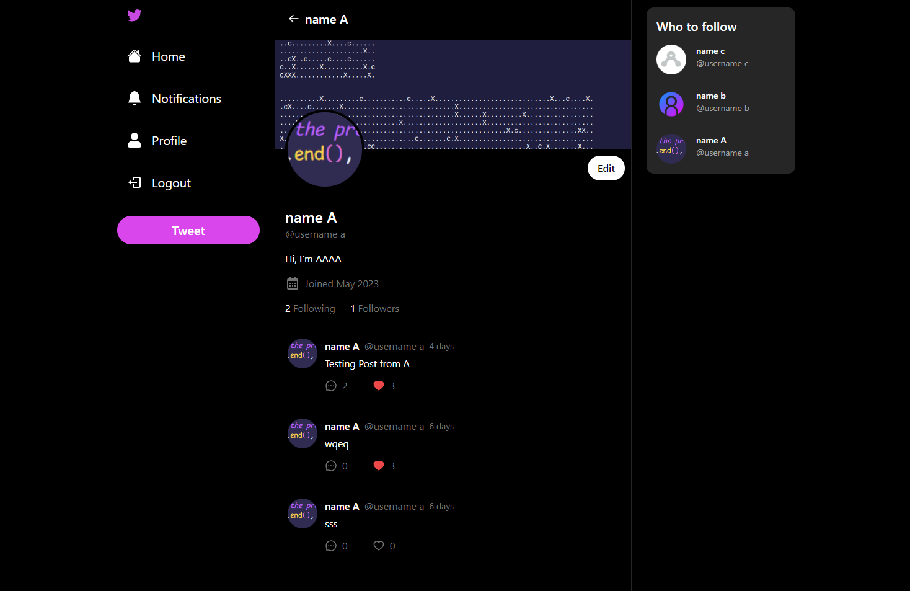
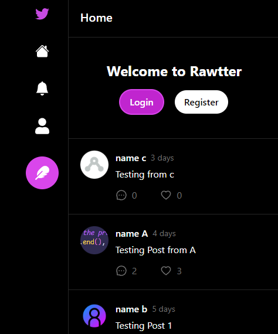

# Rawtter

Rawtter is a Twitter clone built with a modern tech stack, aiming to mimic core Twitter features like making posts, comments, replies, likes, image uploading, and following other users.

## Table of Contents

- [Table of Contents](#table-of-contents)
- [Technologies](#technologies)
- [Features](#features)
- [ScreenShot](#screenshot)
- [Installation](#installation)
- [Deployment](#deployment)
- [Contributing](#contributing)
- [License](#license)
## Technologies

Rawtter is built with the following technologies:

- [React](https://reactjs.org/)
- [Tailwind CSS](https://tailwindcss.com/)
- [Next.js](https://nextjs.org/)
- [TypeScript](https://www.typescriptlang.org/)
- [MongoDB](https://www.mongodb.com/)
- [Prisma](https://www.prisma.io/)
- [NextAuth](https://next-auth.js.org/)
- [Vercel](https://vercel.com/)

## Features

- Authentication (Sign Up, Log In, Log Out) using JWT via NextAuth.
- Create posts.
- Comment and reply to posts.
- Like posts.
- Notifications.
- Upload images (converted to base64 strings).
- Follow other users.
- Profile customization.

## Screenshot
- register and login

- pages

## Installation

Before starting, make sure you have Node.js and npm installed on your machine.

1. Clone this repository:

`git clone https://github.com/fLexsooP/rawtter.git`
`cd Rawtter`

2. Install the dependencies:

`npm install`

3. Set up your MongoDB database and get your connection string.

4. Rename the `.env.example` file to `.env` and fill it with your MongoDB connection string and other configuration details.

5. Run the project:
   `npm run dev`

Open [http://localhost:3000](http://localhost:3000) to view it in the browser.

## Deployment

This project is deployed on Vercel. The database is hosted on MongoDB Atlas.

## Contributing

Contributions, issues and feature requests are welcome. Feel free to check [issues page](https://github.com/your-username/Rawtter/issues) if you want to contribute.

## License

This project is [MIT](https://choosealicense.com/licenses/mit/) licensed.
